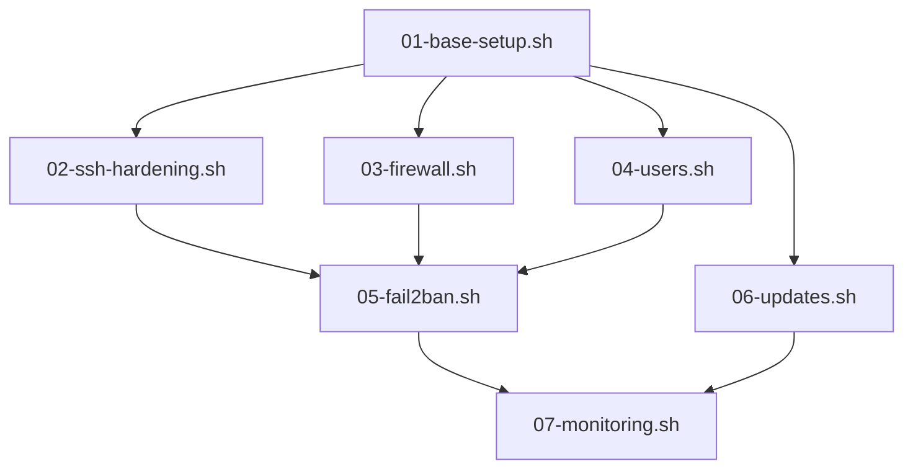

# easy-infra

Setup inicial de servidor Linux — scripts bash idempotentes para provisionar servidores Debian/Ubuntu seguros e padronizados.

## O que faz

Automatiza o setup completo de um servidor Linux em menos de 5 minutos:

```bash
sudo ./run-all.sh
```

Ou execute scripts individuais:

```bash
sudo ./run-all.sh 01 03 05     # apenas base, firewall e fail2ban
sudo ./run-all.sh --dry-run    # lista scripts sem executar
```

## O que é configurado

| Script | O que faz |
|--------|-----------|
| `01-base-setup.sh` | Hostname, timezone, locale, NTP, pacotes essenciais |
| `02-ssh-hardening.sh` | SSH key-only, porta customizável, criptografia moderna, rollback automático |
| `03-firewall.sh` | UFW deny-by-default, rate limiting na porta SSH |
| `04-users.sh` | Usuário admin, sudo sem senha, authorized_keys |
| `05-fail2ban.sh` | Proteção brute-force SSH + jail recidive (ban progressivo) |
| `06-updates.sh` | unattended-upgrades para security patches automáticos |
| `07-monitoring.sh` | sysstat, logwatch, comando `server-health` |

## Princípios

- **Idempotente** — rodar qualquer script duas vezes produz o mesmo resultado
- **Configurável** — tudo via `.env` (copie de `.env.example`)
- **Seguro** — hardening SSH agressivo, firewall deny-by-default, fail2ban
- **Modular** — cada script funciona sozinho ou em sequência

## Quick start

```bash
git clone https://github.com/AngryTux-Infra/easy-infra.git
cd easy-infra

# Configure suas variáveis
cp .env.example .env
vim .env

# Execute como root
sudo ./run-all.sh
```

## Configuração (.env)

```bash
# SSH
SSH_PORT=2222                    # porta customizável (default: 2222)
SSH_PASSWORD_AUTH=no             # apenas chaves SSH
SSH_PERMIT_ROOT_LOGIN=no         # root login desabilitado

# Usuário admin
ADMIN_USER=sysadmin              # nome do usuário admin
ADMIN_SSH_KEY="ssh-ed25519 ..."  # chave pública do admin

# Servidor
SERVER_HOSTNAME=web01            # hostname (vazio = não altera)
SERVER_TIMEZONE=America/Sao_Paulo

# Firewall
ALLOWED_PORTS="80,443"           # portas adicionais além do SSH
FIREWALL_ALLOWED_IPS="10.0.0.0/8"

# Fail2ban
F2B_BANTIME=3600                 # tempo de ban em segundos
F2B_MAXRETRY=5                   # tentativas antes do ban

# Updates
AUTO_REBOOT=false                # reboot automático após updates
```

## Estrutura do projeto

```
easy-infra/
├── run-all.sh                       # Orquestrador principal
├── .env.example                     # Template de configuração
├── lib/
│   └── common.sh                    # Funções compartilhadas (logging, helpers)
├── scripts/
│   ├── 01-base-setup.sh
│   ├── 02-ssh-hardening.sh
│   ├── 03-firewall.sh
│   ├── 04-users.sh
│   ├── 05-fail2ban.sh
│   ├── 06-updates.sh
│   └── 07-monitoring.sh
├── configs/                         # Templates de configuração
│   ├── sshd_config                  # SSH hardening (ADR #3)
│   ├── ssh_banner.txt               # Banner legal
│   ├── fail2ban/
│   │   └── jail.local               # Jails SSH + recidive
│   ├── unattended-upgrades/
│   │   ├── 50unattended-upgrades
│   │   └── 20auto-upgrades
│   ├── sudoers.d/
│   │   └── admin-nopasswd
│   └── monitoring/
│       └── server-health.sh         # Health-check standalone
├── docs/
│   └── convencoes.md                # Convenções agile-issues
├── guides/                          # Guias do workflow
├── templates/                       # Templates de issues
│   ├── issues/
│   │   ├── prd.md
│   │   ├── adr.md
│   │   ├── task.md
│   │   └── bug.md
│   ├── labels.json
│   └── CONTRIBUTING.md
└── claude/
    └── CLAUDE.md                    # Instruções para agentes AI
```

## Cadeia de execução



## Após o setup

Verifique o estado do servidor a qualquer momento:

```bash
server-health
```

## Agent Team

Este projeto foi desenvolvido usando AI agent teams com três papéis:

| Role | Model | Responsabilidades |
|------|-------|-------------------|
| **tech-lead** | Opus | Gerenciamento, decisões técnicas, review advocate |
| **sysops** | Sonnet | Sistema operacional, hardening, serviços |
| **devops** | Sonnet | Estrutura de scripts, automação, idempotência |

## Workflow

Baseado no [agile-issues-template](https://github.com/AngryTux-Infra/agile-issues-template). Issues como contratos de trabalho: PRD → ADR → Task.

## Compatibilidade

- Debian 12+
- Ubuntu 22.04+

## Licença

MIT
