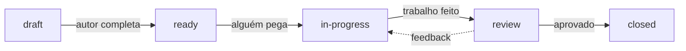
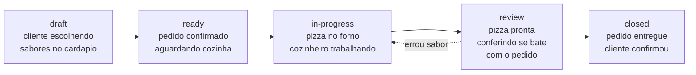

# Convenções — Por que esses tipos e status existem

Este documento explica as convenções usadas no sistema e por que elas funcionam. Não são invenções nossas — são práticas consolidadas da indústria de software, adaptadas para coordenação com AI agents.

## Tipos de issue

### PRD — Product Requirements Document

**O que é**: documento que descreve *o que* construir e *por que*, sem ditar *como*. Define o escopo de negócio e, uma vez aprovado, **só pode ser alterado com intervenção manual** (humano move de volta para `draft`, ajusta, e resubmete para review).

**De onde vem**: a prática de PRDs existe desde os anos 80 em empresas de produto. Hoje, times ágeis usam versões mais enxutas — o importante é separar o "o que queremos" do "como vamos fazer".

**Por que usar**: sem um PRD, cada pessoa (ou agente) interpreta o que precisa ser feito de um jeito diferente. O PRD é o contrato entre quem pede e quem executa.

**Requisitos Funcionais (RF) vs Não-Funcionais (RNF)**:

Um PRD separa dois tipos de requisitos:

- **RF (Requisitos Funcionais)** — *o que* o sistema faz. Comportamentos, funcionalidades, ações.
- **RNF (Requisitos Não-Funcionais)** — *como* o sistema se comporta. Performance, segurança, disponibilidade, usabilidade.

Essa separação existe porque um requisito funcional pode estar completo mas o não-funcional não: "o login funciona" (RF ok) mas "o login demora 15 segundos" (RNF falhou).

**Exemplo não-técnico**: imagine que você quer fazer um bolo de aniversário.

```markdown
## Contexto
Aniversário da Maria, 15 convidados, dia 20/03.

## Requisitos Funcionais (RF)
- [ ] Bolo para 15 pessoas
- [ ] Sabor: chocolate com morango
- [ ] Cobertura decorada com nome "Maria"

## Requisitos Não-Funcionais (RNF)
- [ ] Sem glúten (2 convidados celíacos)
- [ ] Pronto até 16h do dia 20/03
- [ ] Transportável (não pode ser frágil demais para levar de carro)

## Critérios de aceite
- [ ] Serve pelo menos 15 fatias
- [ ] Massa firme (não esfarela ao cortar)
- [ ] Texto legível na cobertura
- [ ] Nenhum ingrediente com glúten na lista
- [ ] Bolo entregue antes das 16h
```

Note como os critérios são **verificáveis** — qualquer pessoa olha o bolo e sabe dizer se passou ou não.

**Regra de imutabilidade**: depois que um PRD é aprovado (closed), ele se torna a **referência oficial**. Se os requisitos precisam mudar, um humano reabre a issue, move para `draft`, ajusta, e repassa por review. **Agentes nunca alteram um PRD aprovado** — isso garante que o escopo de negócio não mude sem supervisão humana.

### ADR — Architecture Decision Record

**O que é**: documento que registra *uma decisão* e o *raciocínio* por trás dela.

**De onde vem**: Michael Nygard popularizou ADRs em 2011. A ideia é que decisões arquiteturais se perdem no tempo — ninguém lembra por que escolheram X em vez de Y seis meses depois. O ADR resolve isso.

**Por que usar**: quando um agente (ou dev) precisa tomar uma decisão que afeta a estrutura do projeto, o ADR força a análise de opções antes de sair codando. E fica documentado para o futuro.

**Exemplo não-técnico**: escolher o local da festa.

```markdown
## Contexto
Preciso de espaço para 15 pessoas, dia 20/03.

## Opções
### Opção 1: Salão de festas
- Prós: espaço amplo, cozinha inclusa
- Contras: custo R$800, precisa reservar com antecedência

### Opção 2: Em casa
- Prós: sem custo de aluguel, ambiente familiar
- Contras: espaço limitado, precisa reorganizar móveis

## Decisão
Em casa — o orçamento é limitado e 15 pessoas cabem na sala se movermos o sofá.

## Consequências
- Preciso mover os móveis na véspera
- Não teremos estacionamento dedicado
```

### Task — Implementação

**O que é**: uma unidade de trabalho concreto com entrega definida.

**De onde vem**: qualquer framework de gerenciamento de projetos (Scrum, Kanban, XP) usa tasks como unidade atômica de trabalho.

**Por que usar**: tasks são o que alguém efetivamente executa. Um PRD diz o que quer, um ADR diz como decidimos fazer, e a task é o "vá lá e faça".

**Exemplo não-técnico**: preparar a massa do bolo.

```markdown
## O que fazer
Preparar massa de chocolate sem glúten usando farinha de arroz.

## Critérios de aceite
- [ ] Massa homogênea sem grumos
- [ ] Assada por 40min a 180°C
- [ ] Teste do palito sai limpo
```

### Bug — Defeito

**O que é**: algo que deveria funcionar mas não funciona.

**De onde vem**: o conceito de "bug" existe desde 1947 (literalmente um inseto preso num relé). Bug reports estruturados são padrão em qualquer time de software.

**Por que usar**: sem estrutura, um report de bug vira "tá quebrado". Com estrutura, qualquer um reproduz o problema.

**Exemplo não-técnico**:

```markdown
## Comportamento atual
O bolo afundou no meio depois de esfriar.

## Comportamento esperado
O bolo deveria manter formato uniforme após esfriar.

## Passos para reproduzir
1. Seguir receita da massa (farinha de arroz, 3 ovos, 200g chocolate)
2. Assar por 40min a 180°C
3. Retirar do forno e esperar esfriar 1h
4. Observar o centro — afundou ~2cm
```

---

## Status — O ciclo de vida

Os status não são arbitrários. Eles formam um **protocolo de handoff** — cada transição tem significado:



| Status | Significado | Quem move para cá |
|--------|-------------|-------------------|
| `draft` | Incompleta, ainda sendo escrita | Autor ao criar |
| `ready` | Completa, dependências OK, pode ser pega | Autor ou lead |
| `in-progress` | Alguém está trabalhando | Dev ou agent ao começar |
| `review` | Trabalho feito, precisa aprovação | Dev ou agent ao terminar |
| `closed` | Aprovada e concluída | Reviewer ao aprovar |

### Exemplo: pedido de pizza

Para entender o ciclo de vida, pense num pedido de pizza:



| Momento | Status | O que acontece |
|---------|--------|----------------|
| Cliente olhando o cardápio, ainda decidindo | `draft` | Pedido incompleto — cozinha não começa |
| Cliente confirmou: "margherita grande, sem cebola" | `ready` | Pedido completo — cozinha pode pegar |
| Cozinheiro pegou o pedido, pizza no forno | `in-progress` | Alguém está trabalhando |
| Pizza saiu do forno, conferindo com o pedido | `review` | Verificando: é margherita? É grande? Sem cebola? |
| Tudo certo, entregue ao cliente | `closed` | Pedido concluído |
| Ops, veio com cebola — volta pro forno | `review` → `in-progress` | Feedback: precisa ajustar |

**Por que não usar "todo", "doing", "done"?**

Porque `draft` → `ready` é um gate de qualidade. Numa pizzaria, se o garçom manda um pedido incompleto para a cozinha ("uma pizza... sei lá, depois decido o sabor"), vira caos. O `draft` impede isso: **ninguém trabalha em algo incompleto**.

**Por que `review` separado de `closed`?**

Porque entrega não é o mesmo que aprovação. A pizza pode sair do forno (entregue) mas vir com o sabor errado (não aprovada). O `review` é o gate onde alguém valida o resultado contra o que foi pedido.

---

## Prioridade

| Label | Quando usar | Exemplo |
|-------|-------------|---------|
| `P0` | Bloqueador — impede uso ou causa dano ativo | API exposta a SQL injection em produção, credenciais vazadas em repo público |
| `P1` | Próxima ação — afeta funcionalidade principal | Endpoint de autenticação sem rate limiting, input validation faltando em formulário de pagamento |
| `P2` | Planejado — sem urgência imediata | Migrar de HTTP básico para OAuth2, adicionar logging estruturado |
| `P3` | Nice to have — se sobrar tempo | Melhorar mensagens de erro da API, adicionar cache em endpoint de leitura |

Prioridade responde duas perguntas:

1. **"Se eu só pudesse trabalhar numa issue hoje, qual seria?"** — isso define o que é P0/P1
2. **"O que vira débito técnico se eu não resolver agora?"** — isso separa P2 de P3

### Exemplo: segurança de uma API

```
P0  API aceita SQL injection no endpoint /users?id=
    → Atacante pode ler/alterar toda a base. Parar tudo e corrigir AGORA.

P1  Endpoint /login não tem rate limiting
    → Permite brute force. Não está sendo explorado hoje, mas é a próxima coisa a resolver.

P2  Tokens JWT não expiram
    → Risco de sessão roubada. Planejado para o próximo ciclo.
    → Se não resolver, vira débito técnico: quanto mais tokens eternos no wild, maior o blast radius.

P3  Mensagens de erro da API expõem stack traces
    → Information disclosure, mas baixo impacto. Resolver quando der.
    → Não vira débito técnico significativo — é cleanup.
```

A diferença entre P2 e P3 é o **débito técnico**: P2 não resolvido cresce com o tempo e fica mais caro depois. P3 não resolvido fica do mesmo tamanho.

---

## Qualificadores

| Label | Significado |
|-------|-------------|
| `blocked` | Depende de outra issue que não está closed |
| `needs-input` | Falta informação — precisa de resposta de alguém |

Esses labels **se somam** ao status. Uma issue pode estar `status:ready` + `blocked` — significa que está completa mas tem uma dependência externa.

---

## Referências entre issues

Issues são **desacopladas mas referenciadas**. Cada issue tem uma seção `## Refs`:

```markdown
## Refs
- PRD: #1
- ADR: #3
- Depends on: #2
- Blocks: #5, #6
```

**Por que não usar sub-issues ou epics?**

Porque referências simples são mais flexíveis e qualquer agente sabe navegar links `#N`. Epics e sub-issues são features específicas de plataformas (Jira, Linear) — `#N` funciona em qualquer lugar que tenha issues.

A regra é uma só: **uma task só vai para `ready` quando tudo que está em "Depends on" estiver closed.**
