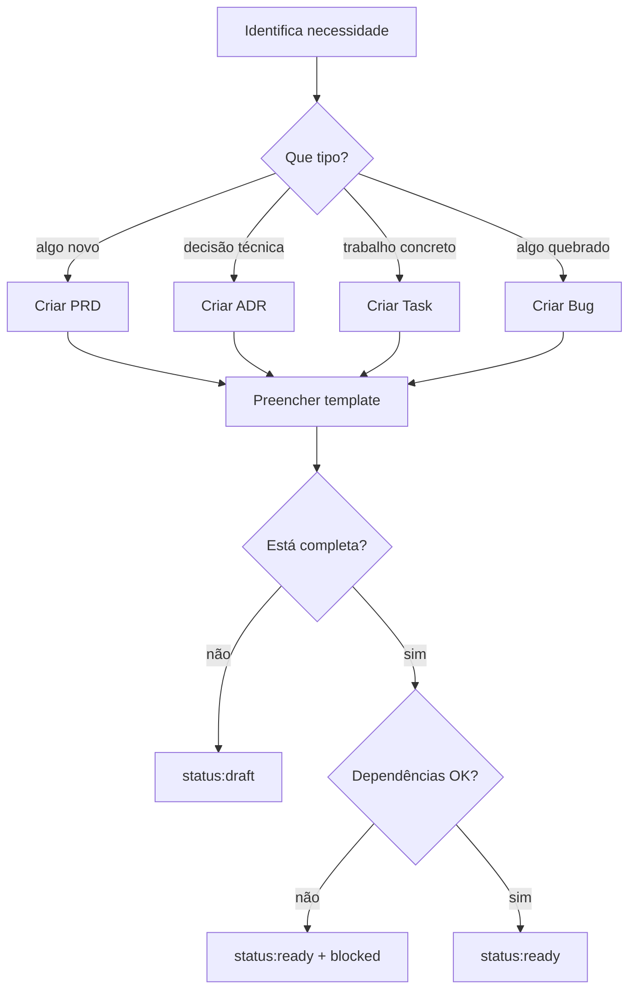
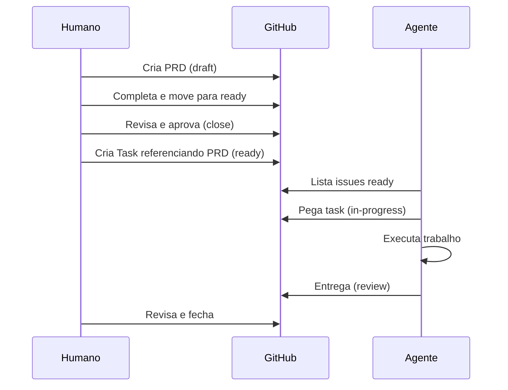
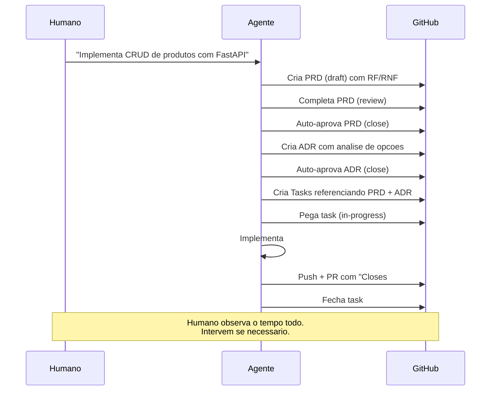
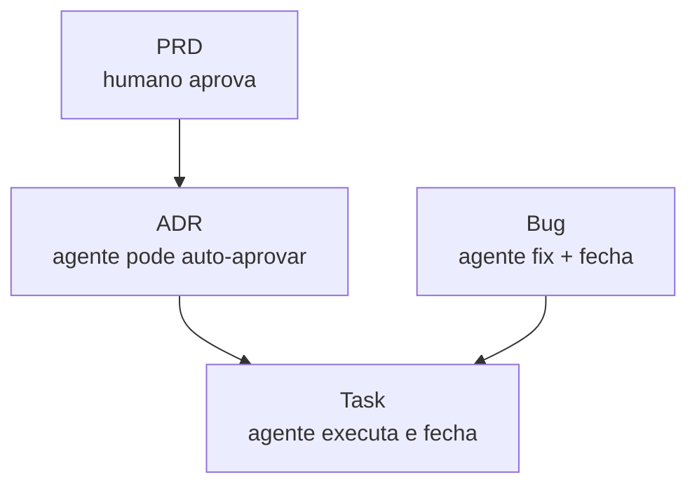

# Criando Issues

Como escrever issues que qualquer agente — de qualquer provider — entende e executa.

## Princípio: a issue é um contrato

Uma issue bem escrita é **auto-contida**. Quem lê (humano ou agente) sabe:

1. **O que** precisa ser feito
2. **Por que** precisa ser feito (contexto)
3. **Como saber que terminou** (critérios de aceite)
4. **O que veio antes** (referências)

Se falta qualquer um desses, a issue está incompleta → fica em `draft`.

## Use os templates

Cada tipo de issue tem um template em `templates/issues/`:

| Template | Quando usar |
|----------|-------------|
| `prd.md` | Definir requisitos de algo novo |
| `adr.md` | Registrar uma decisão entre opções |
| `task.md` | Descrever trabalho concreto para executar |
| `bug.md` | Reportar algo que deveria funcionar mas não funciona |

## Critérios de aceite: a parte mais importante

Critérios vagos geram resultados vagos. Compare:

**Ruim:**
```
- [ ] O sistema funciona corretamente
- [ ] A interface está bonita
```

**Bom:**
```
- [ ] Formulário tem campos: nome, email, telefone
- [ ] Campo email valida formato (contém @ e domínio)
- [ ] Botão "Enviar" desabilitado até todos os campos preenchidos
- [ ] Após envio, exibe mensagem "Cadastro realizado" por 3 segundos
```

**Exemplo não-técnico — organizar uma mudança:**
```
- [ ] Todos os móveis da sala estão no caminhão até 8h
- [ ] Nenhuma caixa sem etiqueta de cômodo (sala, quarto, cozinha)
- [ ] Checklist de itens frágeis conferida antes de fechar o caminhão
- [ ] Chaves do apartamento antigo entregues ao porteiro
```

O critério ideal é aquele que **qualquer pessoa olha e responde sim ou não**, sem interpretação.

## Referências (## Refs)

Toda issue deve ter uma seção `## Refs` no final do body:

```markdown
## Refs
- PRD: #1
- ADR: #3
- Depends on: #2 (precisa estar closed antes)
- Blocks: #5, #6 (só podem começar quando esta fechar)
```

**Por que isso importa**: o agente lê a issue atual, depois navega cada referência para montar o contexto completo. Sem refs, ele trabalha no escuro.

Mesmo que não tenha referências, inclua a seção vazia:

```markdown
## Refs
<!-- Primeira issue — sem dependências -->
```

## Fluxo de criação



## Modos de operacao

O sistema suporta tres modos. A diferenca fundamental e **quem aprova**: o humano, o agente, ou depende do tipo de issue.

### Modo supervisado -- humano aprova cada etapa

O humano cria issues, controla transicoes, e aprova tudo. O agente so executa tasks `ready` e para em `review`.



**Humano controla**: criacao, aprovacao, fechamento.
**Agente controla**: execucao (in-progress -> review).

**Quando usar**: projetos criticos, requisitos sensiveis, aprendendo o sistema, ou quando voce quer validar cada passo.

### Modo autonomo -- agente roda o ciclo completo

O humano da uma diretriz e **observa**. O agente cria PRD, ADR, Tasks, executa, e fecha. O humano acompanha pelas issues e so intervem se algo sair errado.



**Humano controla**: nada ativamente. Observa e intervem quando quer.
**Agente controla**: tudo -- criacao, transicoes, aprovacao, fechamento.

**Quando usar**: tarefas bem definidas, prototipacao rapida, quando voce confia no agente e quer velocidade maxima.

**Como instruir o agente**:

> "Leia o CONTRIBUTING.md. Implementa um CRUD de produtos com FastAPI e SQLite.
> Crie PRD, ADR, e Tasks. Execute tudo ate o final.
> Eu vou acompanhar pelas issues -- so me chame se tiver duvida."

**Como observar sem intervir**:

```bash
# Acompanhar tudo que esta acontecendo
gh issue list --state all --label "type:task"

# Ver o que foi fechado recentemente
gh issue list --state closed --json number,title,closedAt --jq 'sort_by(.closedAt) | reverse | .[:5]'

# Ver PRs abertos pelo agente
gh pr list

# Se precisar intervir: comentar na issue
gh issue comment N --body "Para: o endpoint de busca precisa suportar filtro por preco tambem."
```

O ponto-chave: **o humano nao precisa fazer nada para o fluxo continuar**. Mas pode intervir a qualquer momento -- comentar, bloquear, redirecionar. As issues sao o painel de controle.

### Modo hibrido -- o mais comum

Na pratica, a maioria dos projetos mistura os dois modos dependendo do tipo de issue:

| Tipo | Quem cria | Quem aprova | Por que |
|------|-----------|-------------|---------|
| PRD | Humano ou agente | **Humano** | Escopo de negocio e decisao humana |
| ADR | Agente | Agente ou humano | Decisao tecnica -- agente pode auto-aprovar se o PRD esta claro |
| Task | Agente | Agente | Execucao -- agente fecha via PR |
| Bug | Qualquer | Agente | Fix e verificavel pelos testes |



A regra e: **quanto mais proximo do escopo de negocio, mais supervisao humana. Quanto mais proximo da execucao tecnica, mais autonomia para o agente.**

### Regra universal: agentes nunca deletam issues

Independente do modo, agentes **nunca deletam issues**. Uma issue e um registro -- mesmo que esteja errada ou obsoleta, ela e fechada com um comentario explicando por que, nunca apagada.

| Acao | Supervisado | Autonomo |
|------|-------------|----------|
| Criar issue | Humano | Agente |
| Editar issue body | Humano | Agente (apenas em `draft`) |
| Mover status | Humano | Agente |
| Aprovar e fechar | Humano | Agente |
| Deletar issue | Raro | **Nunca** |
| Reabrir PRD aprovado | Humano | **Nunca** (pedir ao humano) |

## Anti-patterns

| Anti-pattern | Problema | Solução |
|---|---|---|
| Issue sem Refs | Agente não tem contexto | Sempre incluir seção Refs |
| Tudo em uma issue | Escopo imenso, impossível rastrear | Quebrar em PRD → ADR → Tasks |
| Critério vago | Agente não sabe quando terminou | Critérios verificáveis |
| Draft com assignee | Alguém pegou algo incompleto | Só atribuir em ready ou depois |
| Issue sem tipo | Não se sabe o que produzir | Sempre um label `type:` |
