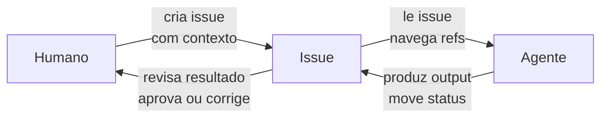
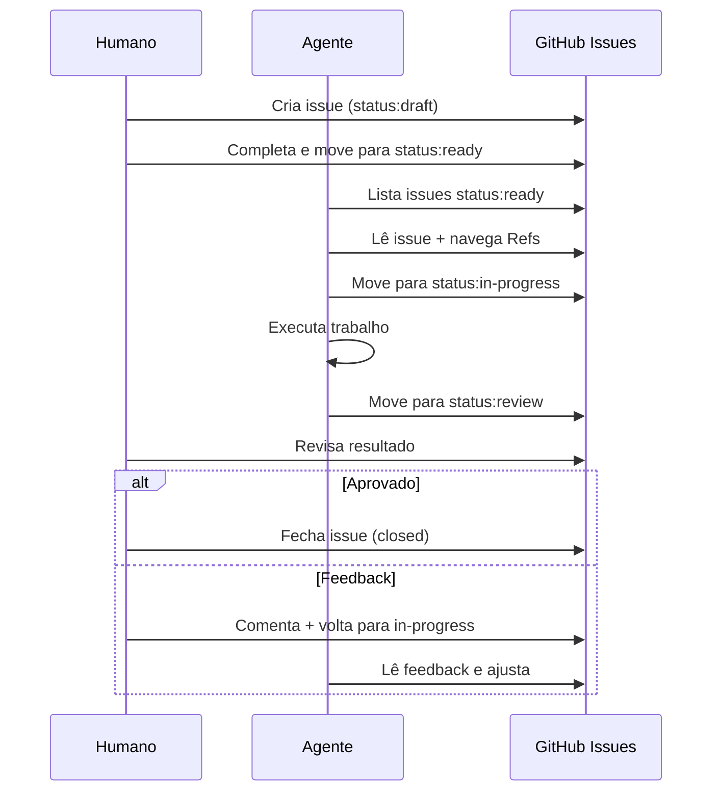
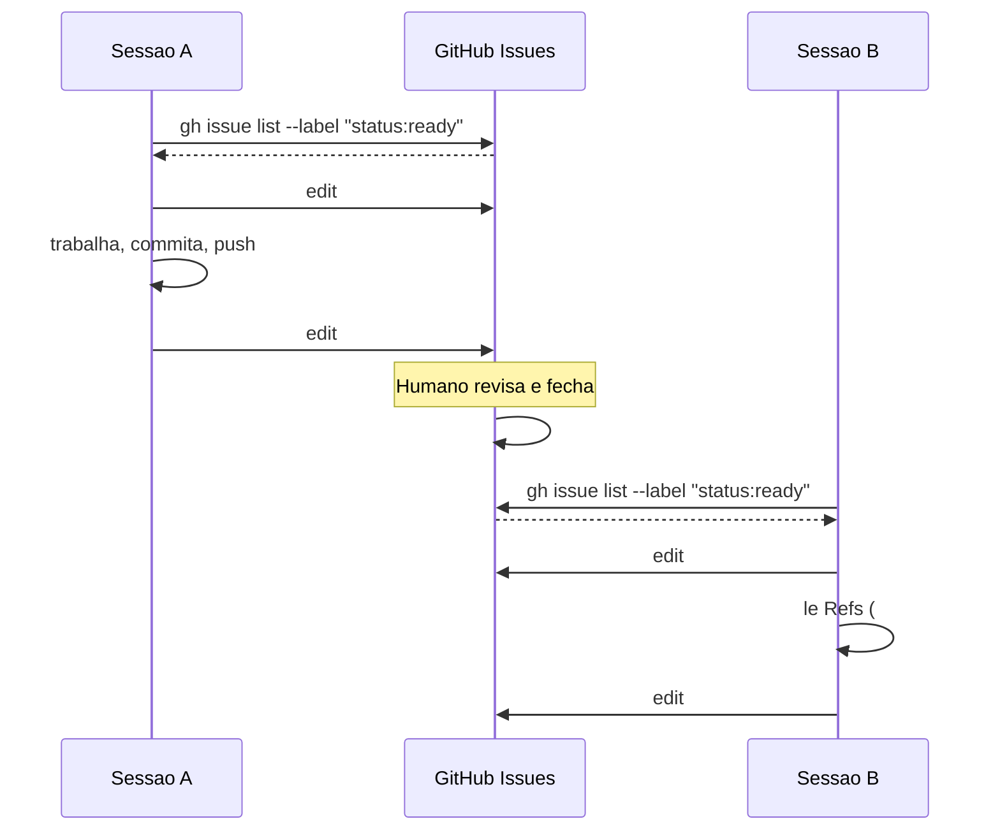
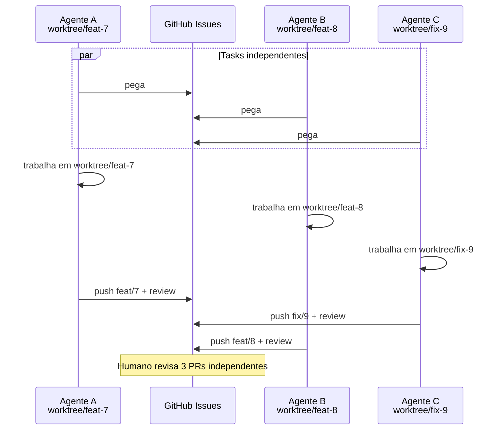

# Trabalhando com Agentes

Como AI agents de qualquer provider usam este sistema para trabalhar de forma autônoma e visível.

## O modelo mental

O agente é um **colaborador assíncrono**. Ele não participa de reuniões, não lê entrelinhas, e não adivinha intenção. Ele lê o que está escrito, segue as convenções, e produz output verificável.

O sistema de issues funciona como o **protocolo de comunicação** entre vocês:



O humano sempre pode intervir — basta olhar as issues para ver o estado de cada coisa e comentar se algo precisa mudar.

## O que o agente faz em cada tipo

| Tipo | Input que lê | Output que produz |
|------|-------------|-------------------|
| `type:prd` | Contexto/necessidade | Issue body com requisitos e critérios |
| `type:adr` | PRD + estado atual | Análise de opções + decisão documentada |
| `type:task` | PRD e/ou ADR aprovados | Entregável concreto (código, config, doc) |
| `type:bug` | Report de reprodução | Fix do problema |

## Sequência de trabalho do agente



## Regras para o agente

Estas regras valem para **qualquer provider ou modelo**:

1. **Nunca trabalhar em `status:draft`** — a issue está incompleta
2. **Sempre ler Refs** — navegar a cadeia inteira antes de agir
3. **Verificar dependências** — se "Depends on: #N" não está closed, marcar como `blocked`
4. **Transições atômicas** — sempre `--remove-label` + `--add-label` no mesmo comando
5. **Referenciar a issue** — PRs com `Closes #N`, commits com `refs #N`
6. **Nunca deletar issues** — fechar com comentário, nunca apagar
7. **Nunca alterar PRD aprovado** — se requisitos precisam mudar, reportar ao humano

## Modos de operacao do agente

O agente opera em um de tres modos, definido pelo humano ao iniciar o trabalho.

### Modo supervisado -- executa e para em review

O humano controla os gates. O agente executa e espera aprovacao.

> "Leia o CONTRIBUTING.md deste repo. Liste as issues `status:ready` e trabalhe na de maior prioridade. Pare em `status:review` e aguarde minha aprovacao."

Ou mais especifico:

> "Leia a issue #5 e execute. Siga as convencoes do CONTRIBUTING.md. Nao feche a issue -- deixe em review para eu validar."

Neste modo o agente:
- Pega issues `ready`, move para `in-progress`
- Executa o trabalho
- Move para `review` e **para**
- Espera o humano aprovar (fechar) ou dar feedback

### Modo autonomo -- ciclo completo sem intervencao

O humano da uma diretriz e observa. O agente roda o ciclo inteiro: cria issues, executa, fecha.

> "Leia o CONTRIBUTING.md. Implementa backup automatizado com restic. Crie PRD, ADR, e Tasks. Execute tudo ate o final. Eu acompanho pelas issues."

Neste modo o agente:
- Cria PRD com RF/RNF
- Auto-aprova PRD (close) se o escopo esta claro
- Cria ADR, analisa opcoes, fecha
- Cria Tasks, executa, fecha via PR (`Closes #N`)
- Comenta progresso nas issues para o humano acompanhar

O humano nao precisa fazer nada para o fluxo continuar. Mas pode intervir a qualquer momento:

```bash
# Observar
gh issue list --state all

# Intervir
gh issue comment N --body "Para: preciso que suporte S3 tambem."
gh issue edit N --add-label "needs-input"
```

### Modo hibrido -- autonomia por tipo

O mais comum. O agente tem autonomia para execucao tecnica mas o humano controla o escopo de negocio.

| Tipo | Agente pode auto-aprovar? | Por que |
|------|--------------------------|---------|
| PRD | Nao -- espera humano | Escopo de negocio e decisao humana |
| ADR | Sim, se PRD esta claro | Decisao tecnica derivada dos requisitos |
| Task | Sim, fecha via PR | Execucao verificavel por testes e criterios |
| Bug | Sim, fecha via PR | Fix verificavel |

> "Leia o CONTRIBUTING.md. Crie PRD para autenticacao OAuth2 e deixe em review -- eu aprovo. Depois disso, crie ADR e Tasks e execute tudo autonomamente."

### Quando o agente deve parar e perguntar

Independente do modo, o agente para quando:

- **Requisitos ambiguos** -- adicionar label `needs-input` e comentar a duvida
- **Dependencia nao resolvida** -- adicionar label `blocked`
- **Conflito entre PRD e ADR** -- reportar ao humano
- **Resultado inesperado** -- nao fechar, comentar o que encontrou
- **Fora do escopo original** -- se o trabalho exige algo nao previsto no PRD, perguntar

## Multiplas sessoes em paralelo

Agentes nao compartilham memoria entre sessoes. Cada sessao comeca do zero. O sistema funciona porque **o estado vive no GitHub, nao no agente**.

### Em serie (uma task por vez)



### Em paralelo (worktrees)

Quando existem tasks **independentes** (sem dependencia entre elas), multiplos agentes podem trabalhar ao mesmo tempo usando **git worktrees**. Cada worktree e uma copia isolada do repo com seu proprio working directory e branch -- sem conflito de checkout.



**O que e um worktree**: um `git worktree` cria um diretorio separado linkado ao mesmo repo `.git`. Cada worktree tem seu proprio branch e arquivos, mas compartilha o historico. Isso permite que 3 agentes trabalhem no mesmo repo sem interferir um no outro.

```bash
# Estrutura no filesystem
projeto/                    # main (checkout principal)
projeto/.worktrees/
  feat-7/                   # branch feat/7-notificacoes
  feat-8/                   # branch feat/8-dashboard
  fix-9/                    # branch fix/9-bug-email
```

**Comandos worktree**:

```bash
# Criar worktree para uma task
git worktree add .worktrees/feat-7 -b feat/7-notificacoes

# Agente trabalha dentro do worktree
cd .worktrees/feat-7
# (edita, commita, push)

# Depois do merge, remover worktree
git worktree remove .worktrees/feat-7
```

**Quando usar worktrees**:

| Cenario | Usar worktree? |
|---------|---------------|
| 2+ tasks independentes, 2+ agentes disponiveis | Sim |
| Tasks com dependencia entre si (blocked) | Nao -- executar em serie |
| Task unica, agente unico | Nao -- branch normal |
| Bug fix urgente (P0) enquanto outra task roda | Sim -- worktree para o fix |

**Regra: so paralelizar tasks que nao tem "Depends on" entre si.** Se #8 depende de #7, nao adianta rodar em paralelo -- #8 vai precisar do output de #7.

### Regras de concorrencia

1. **Assignee e o lock** -- antes de trabalhar, o agente se atribui a issue. Outro agente que veja a issue com assignee sabe que alguem ja pegou
2. **Sempre consultar antes de agir** -- rodar `gh issue list --label "status:ready"` no inicio da sessao, nao assumir que o estado e o mesmo de ontem
3. **Comentar progresso** -- se o trabalho e longo, comentar na issue o que ja foi feito. Isso da contexto para a proxima sessao caso esta seja interrompida
4. **Branch por issue** -- cada task tem seu branch (`feat/7-notificacoes`). Evita conflito entre sessoes paralelas
5. **Nunca trabalhar na mesma issue** -- se a issue tem assignee e esta `in-progress`, escolher outra
6. **Worktree por agente** -- se multiplos agentes rodam ao mesmo tempo, cada um usa seu worktree

### O que cada sessao faz ao iniciar

```bash
# 1. Ler as convencoes
# (o agente le CONTRIBUTING.md automaticamente via CLAUDE.md ou instrucao)

# 2. Ver o que esta disponivel
gh issue list --label "status:ready"

# 3. Ver o que esta em andamento (para nao duplicar trabalho)
gh issue list --label "status:in-progress"

# 4. Pegar a issue de maior prioridade que nao tem assignee
gh issue view N
gh issue edit N --remove-label "status:ready" --add-label "status:in-progress" --add-assignee "@me"

# 5. Se outro agente ja esta trabalhando, criar worktree
git worktree add .worktrees/feat-N -b feat/N-descricao
cd .worktrees/feat-N
```

### Sessao interrompida

Se uma sessao e interrompida no meio do trabalho:

- A issue fica `in-progress` com assignee
- A proxima sessao ve isso e pode:
  - **Continuar**: ler os commits/comentarios e retomar de onde parou
  - **Perguntar**: comentar na issue "sessao anterior interrompida, retomando" e seguir
- O branch com trabalho parcial esta no repo -- nada se perde

### Por que funciona sem memoria compartilhada

| O que o agente precisa saber | Onde esta |
|------------------------------|----------|
| O que fazer | Issue body |
| Contexto completo | Refs -> PRD, ADR |
| O que ja foi feito | Commits no branch, comentarios na issue |
| O que esta disponivel | `gh issue list --label "status:ready"` |
| O que nao tocar | `gh issue list --label "status:in-progress"` |

O GitHub e a **fonte de verdade**. O agente e stateless -- ele consulta, age, e registra. A proxima sessao encontra tudo no lugar.

## Provider-agnostico

Este sistema funciona com qualquer agente que consiga:

1. **Executar `gh` CLI** — para ler e manipular issues
2. **Ler markdown** — para entender o body da issue
3. **Seguir instruções** — para respeitar as convenções

Isso inclui Claude, GPT, Gemini, Copilot, LLaMA, Mistral, ou qualquer modelo com acesso a terminal.

### Instruções por provider

Cada provider tem sua forma de receber instruções persistentes:

| Provider | Onde colocar instruções |
|----------|------------------------|
| Claude Code | `CLAUDE.md` na raiz do repo |
| GitHub Copilot | `.github/copilot-instructions.md` |
| Cursor | `.cursorrules` |
| Aider | `.aider.conf.yml` |
| Outros | `CONTRIBUTING.md` como referência universal |

O diretório `claude/` deste repo tem um exemplo para Claude Code, mas adapte para seu provider.

## Intervindo no trabalho

A qualquer momento você pode:

- **Ver estado**: `gh issue list --label "status:in-progress"`
- **Comentar**: `gh issue comment N --body "Ajuste X antes de continuar"`
- **Bloquear**: `gh issue edit N --add-label "blocked" --body "Parou: falta definir Y"`
- **Redirecionar**: mover de volta para `draft` se o escopo mudou

O agente vê seus comentários na próxima vez que ler a issue.
