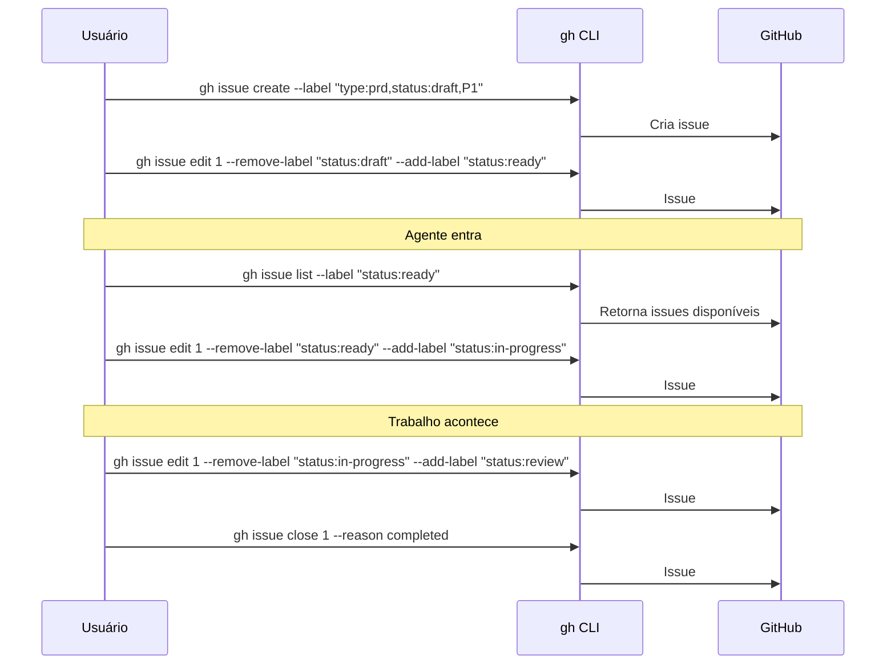

# gh CLI — Referência

Por que `gh` CLI e como usar para operar o sistema de issues.

## O que o gh faz

O `gh` é o GitHub inteiro no terminal. Não é só um wrapper de git — ele gerencia todo o workspace:

| Categoria | O que faz | Exemplos |
|-----------|-----------|----------|
| **Repos** | Criar, clonar, deletar, forkar, configurar | `gh repo create`, `gh repo clone`, `gh repo delete` |
| **Issues** | Criar, editar, listar, fechar, comentar, labels | `gh issue create`, `gh issue edit`, `gh issue list` |
| **PRs** | Criar, revisar, merge, checks, diff | `gh pr create`, `gh pr merge`, `gh pr checks` |
| **Git** | Push, pull, checkout, gerenciar branches | `gh repo sync`, integração nativa com git |
| **Labels** | Criar, editar, deletar labels do repo | `gh label create`, `gh label delete` |
| **API** | Acessar qualquer endpoint da API do GitHub | `gh api repos/org/repo/issues` |
| **Auth** | Login, logout, gerenciar tokens e scopes | `gh auth login`, `gh auth refresh` |

Isso significa que um agente com acesso ao `gh` tem **controle total do workspace** sem sair do terminal.

## Por que gh CLI e não o browser

### 1. Agentes operam em terminal

Um AI agent não tem browser. Ele executa comandos. O `gh` é a interface natural entre o agente e o GitHub — mesma API, sem camada visual.

### 2. Auditável e reproduzível

Todo comando que o agente executa pode ser:
- **Logado** — você vê exatamente o que aconteceu
- **Reproduzido** — copie e cole o comando para repetir
- **Versionado** — guarde sequências de comandos como scripts

No browser, ações são invisíveis. No terminal, tudo é rastro.

### 3. Scriptável

Transições de status, criação de issues, e consultas viram one-liners. Isso permite automação sem ferramentas extras.

### 4. Provider-agnóstico

`gh` CLI funciona igual para qualquer agente — Claude, GPT, Gemini, Copilot. Nenhum precisa de integração especial.

### 5. Workspace completo

O agente não precisa de ferramentas extras. Com `gh` + `git` ele:
- Cria o repo
- Faz push do código
- Abre issues com labels
- Transiciona status
- Abre PRs referenciando issues
- Tudo num único fluxo de terminal

---

## Comandos por operação

### Repos

```bash
# Criar repo e clonar
gh repo create org/repo --private --clone

# Criar a partir de diretório existente
gh repo create org/repo --private --source . --push

# Clonar
gh repo clone org/repo

# Deletar (precisa scope delete_repo)
gh repo delete org/repo --yes

# Listar repos da org
gh repo list org --json name

# Ver info do repo
gh repo view org/repo
```

### Criar issues

```bash
# Com labels inline
gh issue create --label "type:task,status:draft,P1" \
  --title "Título da issue" \
  --body "corpo em markdown"

# Com body de arquivo
gh issue create --label "type:prd,status:draft,P1" \
  --title "Título" --body-file body.md

# Em repo específico
gh issue create --repo org/repo --label "type:task,status:draft,P2" \
  --title "Título" --body "corpo"
```

### Transições de status

```bash
# draft → ready (autor completou)
gh issue edit N --remove-label "status:draft" --add-label "status:ready"

# ready → in-progress (alguém pegou)
gh issue edit N --remove-label "status:ready" --add-label "status:in-progress" \
  --add-assignee "@me"

# in-progress → review (trabalho feito)
gh issue edit N --remove-label "status:in-progress" --add-label "status:review"

# review → in-progress (feedback, precisa ajustar)
gh issue edit N --remove-label "status:review" --add-label "status:in-progress"
```

### Fechar issues

```bash
# Fechar com comentário
gh issue close N --reason completed --comment "Entregue no PR #12"

# Via PR (automático — GitHub fecha quando o PR é merged)
# No body do PR: "Closes #N"
```

### Consultas

```bash
# Issues disponíveis para pegar
gh issue list --label "status:ready"

# Issues para revisar
gh issue list --label "status:review"

# Tasks em andamento
gh issue list --label "type:task" --label "status:in-progress"

# Urgências
gh issue list --label "P0"

# Bloqueadas
gh issue list --label "blocked"

# Minhas issues
gh issue list --assignee "@me"

# PRDs aprovados
gh issue list --label "type:prd" --state closed

# Ver detalhes de uma issue
gh issue view N

# Ver com comentários
gh issue view N --comments
```

### Labels

```bash
# Listar labels do repo
gh label list

# Marcar como bloqueada (adiciona qualificador)
gh issue edit N --add-label "blocked"

# Desbloquear
gh issue edit N --remove-label "blocked"

# Pedir input
gh issue edit N --add-label "needs-input"
```

### Comentários

```bash
# Adicionar comentário
gh issue comment N --body "Feedback: ajustar X antes de prosseguir"

# Comentário com heredoc (para texto longo)
gh issue comment N --body "$(cat <<'EOF'
## Feedback

- Criterio 1: OK
- Criterio 2: precisa ajuste -- faltou Y
- Criterio 3: OK

Por favor ajuste o item 2 e mova de volta para review.
EOF
)"
```

### PRs

```bash
# Criar PR referenciando issue
gh pr create --title "Implementar timer systemd" \
  --body "Closes #5"

# Listar PRs abertos
gh pr list

# Ver checks de um PR
gh pr checks N
```

---

## Diagrama: fluxo típico via CLI


