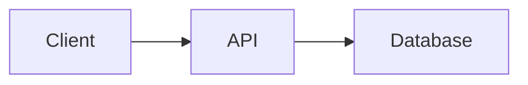

# Contributing

## Workflow

Este projeto usa GitHub Issues como protocolo de coordenação. Toda mudança passa pelo fluxo:

1. **Issue existe e está `status:ready`** — não trabalhe em issues `draft`
2. **Pegue a issue** — mova para `status:in-progress` e se atribua
3. **Faça o trabalho** em um branch dedicado
4. **Abra PR** referenciando a issue (`Closes #N`)
5. **Mova para `status:review`** — aguarde aprovação

## Labels

Cada issue tem exatamente:
- **Um tipo**: `type:prd`, `type:adr`, `type:task`, `type:bug`
- **Um status**: `status:draft` → `status:ready` → `status:in-progress` → `status:review` → closed
- **Uma prioridade**: `P0` (crítico) → `P1` (próxima ação) → `P2` (planejado) → `P3` (nice to have)

Transições de status são sempre atômicas:

```bash
gh issue edit N --remove-label "status:ready" --add-label "status:in-progress" --add-assignee "@me"
```

## Referências entre issues

Toda issue tem uma seção `## Refs` com dependências. Uma task só pode ir para `status:ready` quando tudo em "Depends on" estiver closed.

## Convencoes de output

Todo trabalho entregue deve incluir **diagramas visuais** que permitam entender a solucao sem ler o codigo:

### Estrutura de diretorios (tree)

Sempre que o trabalho criar ou modificar arquivos, incluir a estrutura no PR ou comentario da issue:

```
projeto/
├── app/
│   ├── main.py
│   ├── models.py
│   └── routes/
│       ├── __init__.py
│       └── products.py
├── tests/
│   └── test_products.py
└── requirements.txt
```

### Diagramas de arquitetura e fluxo (mermaid)

Sempre que o trabalho envolver fluxo de dados, integracao entre componentes, ou decisao de arquitetura, incluir diagrama mermaid:



O GitHub renderiza mermaid nativamente em issues, PRs e markdown. Tipos uteis:

- `graph LR/TD` -- arquitetura de componentes, fluxo de dados
- `sequenceDiagram` -- interacao entre servicos/atores
- `erDiagram` -- modelo de dados/entidades
- `flowchart` -- logica de decisao, pipelines

### Quando usar cada um

| Situacao | O que incluir |
|----------|---------------|
| Criou/alterou arquivos | Tree da estrutura afetada |
| Definiu arquitetura (ADR) | Diagrama de componentes (graph) |
| Integrou servicos | Diagrama de sequencia (sequenceDiagram) |
| Modelou dados | Diagrama ER (erDiagram) |
| Fluxo com decisoes | Flowchart (flowchart) |

Esses diagramas servem como **documentacao viva** -- quem lê a issue ou o PR entende a solucao visualmente.

## Branches

- `main` -- branch principal
- `feat/N-descricao` -- features (N = numero da issue)
- `fix/N-descricao` -- bug fixes

Formato: prefixo + numero da issue + descricao curta. Exemplo: `feat/7-notificacoes`, `fix/9-tracking-code`.

## Worktrees (trabalho paralelo)

Quando multiplos agentes trabalham ao mesmo tempo, cada um usa um **git worktree** para evitar conflitos:

```bash
# Criar worktree para a task
git worktree add .worktrees/feat-N -b feat/N-descricao

# Trabalhar dentro do worktree
cd .worktrees/feat-N

# Depois do merge, limpar
git worktree remove .worktrees/feat-N
```

Regras:
- So paralelizar tasks **independentes** (sem "Depends on" entre si)
- Cada worktree = um branch = uma issue
- Remover worktree depois que o PR for merged

## Commits

- Mensagens descritivas
- Referenciar issues: `refs #N`, `closes #N`
