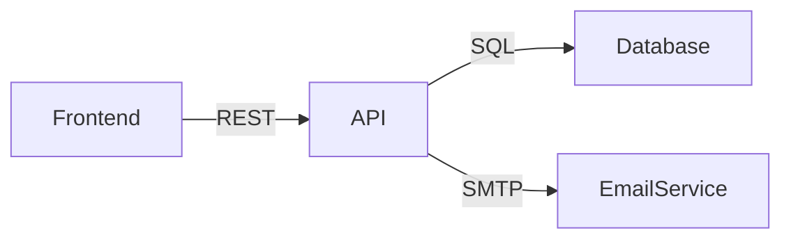

## Contexto

<!-- Qual decisão precisa ser tomada? Por que agora? O que acontece se não decidir? -->

## Opções consideradas

### Opção 1: [nome]

- **Prós**: ...
- **Contras**: ...

### Opção 2: [nome]

- **Prós**: ...
- **Contras**: ...

## Decisão

<!-- Qual opção foi escolhida e por quê. Seja explícito sobre o trade-off aceito. -->

## Arquitetura

<!--
Diagrama mermaid mostrando a arquitetura resultante da decisao.
Usar graph para componentes, sequenceDiagram para fluxos, erDiagram para dados.

Exemplo:

-->

## Consequencias

<!-- O que muda com esta decisao? O que nao sera mais possivel? -->

## Refs

- PRD: #N
<!-- - Tasks geradas: #N, #N -->
