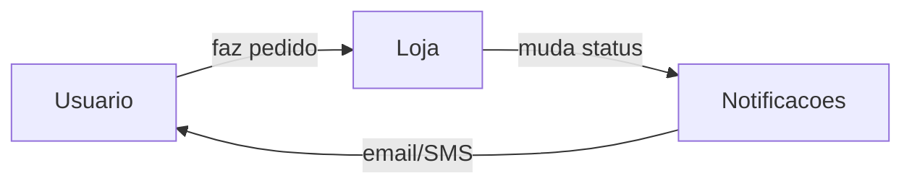

## Contexto

<!-- Por que isso precisa existir? Qual problema resolve? Quem é afetado? -->

## Requisitos Funcionais (RF)

<!--
O que o sistema deve FAZER. Comportamentos, funcionalidades, ações.
Cada item é uma capacidade concreta.
-->

- [ ] ...

## Requisitos Não-Funcionais (RNF)

<!--
COMO o sistema deve se comportar. Performance, segurança, disponibilidade, usabilidade.
Exemplo: "resposta em menos de 200ms", "sem downtime durante deploy", "acessível em mobile"
-->

- [ ] ...

## Critérios de aceite

<!--
Como saber que está pronto? Cada critério deve ser verificável — alguém olha e diz sim ou não.

Exemplo bom:  "Formulário tem campos nome, email, telefone"
Exemplo ruim: "Formulário funciona corretamente"
-->

- [ ] ...

## Visao geral

<!--
Diagrama de alto nivel mostrando o que esta sendo construido e como se encaixa.
Nao precisa ser tecnico -- pode ser o fluxo do usuario ou a relacao entre partes do sistema.

Exemplo:

-->

## Fora de escopo

<!-- O que NAO faz parte desta entrega. Evita scope creep. -->

- ...

## Refs

<!-- Issues relacionadas. Mesmo vazia, mantenha a seção. -->
<!-- - ADR: #N -->
<!-- - Tasks: #N, #N -->
