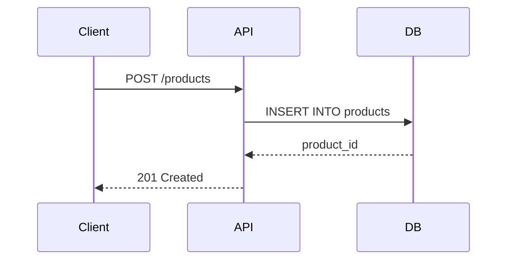

## O que fazer

<!-- Descrição clara do trabalho. Concreto e actionable. -->

## Critérios de aceite

<!--
Cada critério é verificável — olha e diz sim ou não.
Inclua o "como verificar" quando não for óbvio.
-->

- [ ] ...

## Estrutura

<!--
Tree dos arquivos criados ou modificados por esta task.
Preencher ao concluir o trabalho (ou antes, se a estrutura ja estiver definida).

Exemplo:
```
app/
├── models.py        # novo
├── schemas.py       # novo
└── routes/
    └── products.py  # modificado
```
-->

## Diagramas

<!--
Incluir se a task envolver fluxo de dados, integracao entre componentes, ou logica complexa.
Usar mermaid (GitHub renderiza nativamente).

Exemplo:

-->

## Notas

<!-- Detalhes que ajudam quem vai executar. Restricoes, edge cases, referencias. -->

## Refs

- PRD: #N
<!-- - ADR: #N -->
<!-- - Depends on: #N -->
<!-- - Blocks: #N -->
